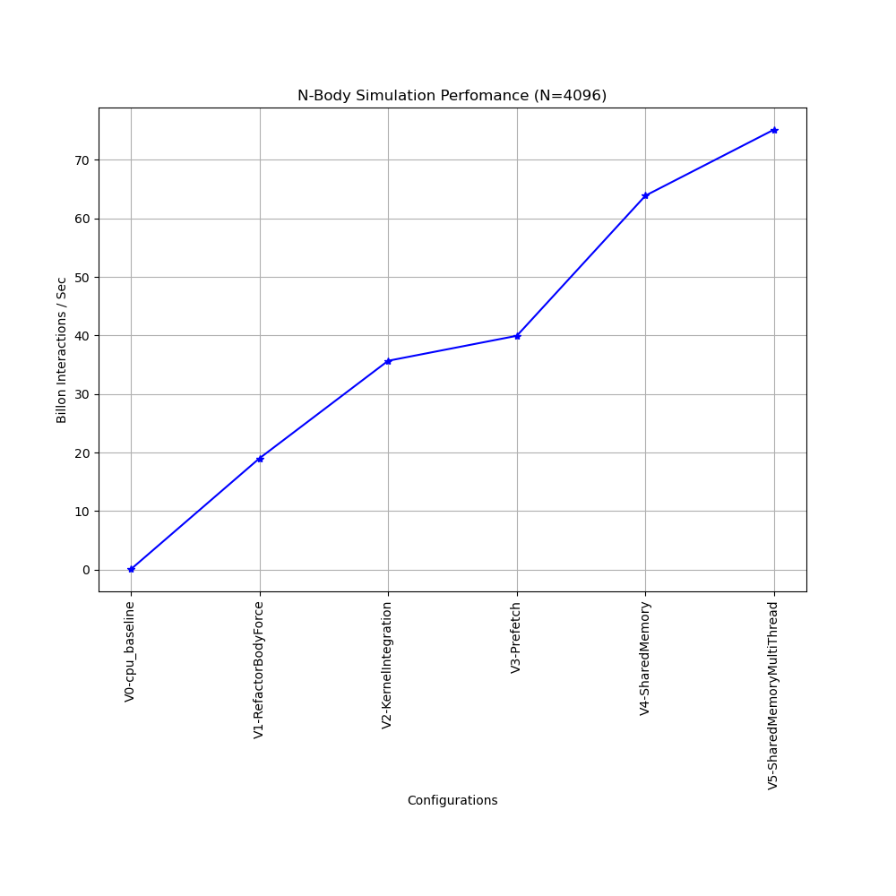

## CUDA N-Body Simulation

---

### Dependencies

- CMake > 3.18
- CUDA > 11.1
- Boost > 1.71

### Pull third party submodules

```
$ cd <repo_root>
$ git submodule update --init --recursive
```

### Build

```
$ cd <repo_root>
$ mkdir build && cd build
$ cmake ..
$ make
```

### Run all tests

```
$ cd <repo_root>/bin
$ ./cuda_nbody_test
```

### Query GPU hardware specification

- Tests were conducted using `GeForce GTX 1650 Ti`.
- To query the specification of the GPU, execute the following in a terminal:
    ```
    $ ~/NVIDIA_CUDA-11.1_Samples/bin/x86_64/linux/release/deviceQuery
    ~/NVIDIA_CUDA-11.1_Samples/bin/x86_64/linux/release/deviceQuery Starting...

    CUDA Device Query (Runtime API) version (CUDART static linking)

    Detected 1 CUDA Capable device(s)

    Device 0: "GeForce GTX 1650 Ti"
    CUDA Driver Version / Runtime Version          11.1 / 11.1
    CUDA Capability Major/Minor version number:    7.5
    Total amount of global memory:                 3903 MBytes (4093050880 bytes)
    (16) Multiprocessors, ( 64) CUDA Cores/MP:     1024 CUDA Cores
    GPU Max Clock rate:                            1485 MHz (1.49 GHz)
    Memory Clock rate:                             6001 Mhz
    Memory Bus Width:                              128-bit
    L2 Cache Size:                                 1048576 bytes
    Maximum Texture Dimension Size (x,y,z)         1D=(131072), 2D=(131072, 65536), 3D=(16384, 16384, 16384)
    Maximum Layered 1D Texture Size, (num) layers  1D=(32768), 2048 layers
    Maximum Layered 2D Texture Size, (num) layers  2D=(32768, 32768), 2048 layers
    Total amount of constant memory:               65536 bytes
    Total amount of shared memory per block:       49152 bytes
    Total shared memory per multiprocessor:        65536 bytes
    Total number of registers available per block: 65536
    Warp size:                                     32
    Maximum number of threads per multiprocessor:  1024
    Maximum number of threads per block:           1024
    Max dimension size of a thread block (x,y,z): (1024, 1024, 64)
    Max dimension size of a grid size    (x,y,z): (2147483647, 65535, 65535)
    Maximum memory pitch:                          2147483647 bytes
    Texture alignment:                             512 bytes
    Concurrent copy and kernel execution:          Yes with 3 copy engine(s)
    Run time limit on kernels:                     Yes
    Integrated GPU sharing Host Memory:            No
    Support host page-locked memory mapping:       Yes
    Alignment requirement for Surfaces:            Yes
    Device has ECC support:                        Disabled
    Device supports Unified Addressing (UVA):      Yes
    Device supports Managed Memory:                Yes
    Device supports Compute Preemption:            Yes
    Supports Cooperative Kernel Launch:            Yes
    Supports MultiDevice Co-op Kernel Launch:      Yes
    Device PCI Domain ID / Bus ID / location ID:   0 / 1 / 0
    Compute Mode:
        < Default (multiple host threads can use ::cudaSetDevice() with device simultaneously) >

    deviceQuery, CUDA Driver = CUDART, CUDA Driver Version = 11.1, CUDA Runtime Version = 11.1, NumDevs = 1
    Result = PASS
    ```

### Run CPU baseline with `4096` bodies

source: <a href='./src/01-nbody_cpu.cu'>01-nbody_cpu.cu</a>

```
$ cd <repo_root>/bin
$ ./01-nbody_cpu 4096
0-th body
x,y,z:[0.000,0.000,0.000]
vx,vy,vz:[1.000,1.000,1.000]
4095-th body
x,y,z:[4095.000,4095.000,4095.000]
vx,vy,vz:[1.000,1.000,1.000]
4096 Bodies: average execution time = 441.687798 milliseconds
4096 Bodies: average 0.038 Billion Interactions / second
```

- Baseline performance of `4096` bodies simulation with single threaded CPU execution is `0.038 Billion Interactions / second`.

### GPU version 1: Refactor `BodyForce` function into GPU kernel

source: <a href='./tests/Test01_RefactorBodyForce.cu'>Test01_RefactorBodyForce.cu</a>

```
$ ./cuda_nbody_test --gtest_filter=Test01_RefactorBodyForce._4096BodiesTest
Running main() from ~/Documents/src/cpp/cuda-nbody/thirdparty/googletest/googletest/src/gtest_main.cc
Note: Google Test filter = Test01_RefactorBodyForce._4096BodiesTest
[==========] Running 1 test from 1 test suite.
[----------] Global test environment set-up.
[----------] 1 test from Test01_RefactorBodyForce
[ RUN      ] Test01_RefactorBodyForce._4096BodiesTest
4096 Bodies: average execution time = 0.882701 milliseconds
4096 Bodies: average 19.006683 Billion Interactions / second
[       OK ] Test01_RefactorBodyForce._4096BodiesTest (147 ms)
[----------] 1 test from Test01_RefactorBodyForce (147 ms total)

[----------] Global test environment tear-down
[==========] 1 test from 1 test suite ran. (147 ms total)
[  PASSED  ] 1 test.
```

### GPU version 2: Refactor `integration` function into GPU kernel

source: <a href='./tests/Test02_KernelIntegration.cu'>Test02_KernelIntegration.cu</a>

```
$ ./cuda_nbody_test --gtest_filter=Test02_KernelIntegration._4096BodiesTest
Running main() from ~/Documents/src/cpp/cuda-nbody/thirdparty/googletest/googletest/src/gtest_main.cc
Note: Google Test filter = Test02_KernelIntegration._4096BodiesTest
[==========] Running 1 test from 1 test suite.
[----------] Global test environment set-up.
[----------] 1 test from Test02_KernelIntegration
[ RUN      ] Test02_KernelIntegration._4096BodiesTest
4096 Bodies: average execution time = 0.470300 milliseconds
4096 Bodies: average 35.673443 Billion Interactions / second
[       OK ] Test02_KernelIntegration._4096BodiesTest (150 ms)
[----------] 1 test from Test02_KernelIntegration (150 ms total)

[----------] Global test environment tear-down
[==========] 1 test from 1 test suite ran. (150 ms total)
[  PASSED  ] 1 test.
```

### GPU version 3: Memory prefetching

source: <a href='./tests/Test03_Prefetch.cu'>Test03_Prefetch.cu</a>

```
$ ./cuda_nbody_test --gtest_filter=Test03_Prefetch._4096BodiesTest
Running main() from ~/Documents/src/cpp/cuda-nbody/thirdparty/googletest/googletest/src/gtest_main.cc
Note: Google Test filter = Test03_Prefetch._4096BodiesTest
[==========] Running 1 test from 1 test suite.
[----------] Global test environment set-up.
[----------] 1 test from Test03_Prefetch
[ RUN      ] Test03_Prefetch._4096BodiesTest
4096 Bodies: average execution time = 0.420055 milliseconds
4096 Bodies: average 39.940559 Billion Interactions / second
[       OK ] Test03_Prefetch._4096BodiesTest (145 ms)
[----------] 1 test from Test03_Prefetch (145 ms total)

[----------] Global test environment tear-down
[==========] 1 test from 1 test suite ran. (145 ms total)
[  PASSED  ] 1 test.
```

### GPU version 4: Shared memory

source: <a href='./tests/Test04_SharedMemory1D.cu'>Test04_SharedMemory1D.cu</a>

```
$ ./cuda_nbody_test --gtest_filter=Test04_SharedMemory1D._4096BodiesTest
Running main() from ~/Documents/src/cpp/cuda-nbody/thirdparty/googletest/googletest/src/gtest_main.cc
Note: Google Test filter = Test04_SharedMemory1D._4096BodiesTest
[==========] Running 1 test from 1 test suite.
[----------] Global test environment set-up.
[----------] 1 test from Test04_SharedMemory1D
[ RUN      ] Test04_SharedMemory1D._4096BodiesTest
4096 Bodies: average execution time = 0.262564 milliseconds
4096 Bodies: average 63.897747 Billion Interactions / second
[       OK ] Test04_SharedMemory1D._4096BodiesTest (167 ms)
[----------] 1 test from Test04_SharedMemory1D (167 ms total)

[----------] Global test environment tear-down
[==========] 1 test from 1 test suite ran. (167 ms total)
[  PASSED  ] 1 test.
```

### GPU version 5: Shared memory (MultiThread)

source: <a href='./tests/Test05_SharedMemory2D.cu'>Test05_SharedMemory2D.cu</a>

```
$ ./cuda_nbody_test --gtest_filter=Test05_SharedMemory2D._4096BodiesTest
Running main() from /home/ray/Documents/src/cpp/cuda-nbody/thirdparty/googletest/googletest/src/gtest_main.cc
Note: Google Test filter = Test05_SharedMemory2D._4096BodiesTest
[==========] Running 1 test from 1 test suite.
[----------] Global test environment set-up.
[----------] 1 test from Test05_SharedMemory2D
[ RUN      ] Test05_SharedMemory2D._4096BodiesTest
4096 Bodies: average execution time = 0.223154 milliseconds
4096 Bodies: average 75.182198 Billion Interactions / second
[       OK ] Test05_SharedMemory2D._4096BodiesTest (139 ms)
[----------] 1 test from Test05_SharedMemory2D (139 ms total)

[----------] Global test environment tear-down
[==========] 1 test from 1 test suite ran. (139 ms total)
[  PASSED  ] 1 test.
```

### Results (N-Body Simulation, `N=4096`)

|Configuration|Billion Interactions / Sec|Improvement vs baseline|
|:-|:-:|:-:|
|V0-cpu_baseline|0.038|-|
|V1-RefactorBodyForce|19.007|500x|
|V2-KernelIntegration|35.673|938x|
|V3-Prefetch|39.941|1051x|
|V4-SharedMemory|63.898|1681x|
|V5-SharedMemoryMultiThread|75.182|1978x|

